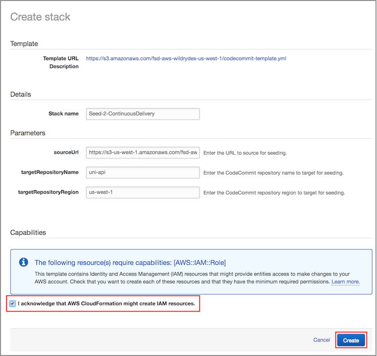
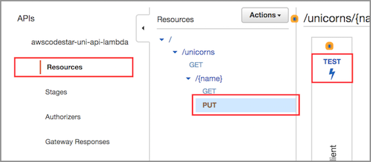

# Module 2: Continuous Delivery Pipeline

In this module, you'll use [AWS CodePipeline](https://aws.amazon.com/codepipeline/), [AWS CodeBuild](https://aws.amazon.com/codebuild/), and [Amazon S3](https://aws.amazon.com/s3/) to build a Continuous Delivery pipeline to automate a code deployment workflow for the Unicorn API.

## CodePipeline Overview

CodePipeline orchestrates the steps to build, test, and deploy your code changes.  Below is a screenshot of the CodePipeline you will build when have completed this module.


## CodeBuild Overview

CodeBuild compiles source code, runs tests, and produces software packages that are ready to deploy to environments.

The Unicorn API [buildspec.yml](buildspec.yml) defines the commands used to build the project and the output artifacts.

```yaml
version: 0.1

phases:
  build:
    commands:
      - cd app && npm install
      - aws cloudformation package --template app-sam.yaml --s3-bucket $S3_BUCKET --output-template template-export.json

artifacts:
  type: zip
  files:
    - template-export.json
```

For the Unicorn API, the build command is the same **CloudFormation package** command used from the [Serverless Application Model: Step 2](../1_ServerlessApplicationModel#2-package-the-uni-api-for-deployment), except that the S3 bucket has been externalized to an environment variable that CodeStar has configured on the project.

As a reminder, the **CloudFormation package** command packages the local source code, uploads it to S3, and returns a new CloudFormation template that has been modified to use the S3 references as the CodeUri.

For the Unicorn API, the output artifact is a zip archive that includes only the ``template-export.json`` file.

## Implementation Instructions

Each of the following sections provide an implementation overview and detailed, step-by-step instructions. The overview should provide enough context for you to complete the implementation if you're already familiar with the AWS Management Console or you want to explore the services yourself without following a walkthrough.

If you're using the latest version of the Chrome, Firefox, or Safari web browsers the step-by-step instructions won't be visible until you expand the section.

### 1. Seed the `uni-api` CodeCommit Git repository

1. Each module has corresponding source code used to seed the CodeStar CodeCommit Git repository to support the workshop.  To seed the CodeCommit Git repository, click on the **Launch Stack** button for your region below:

    Region| Launch
    ------|-----
    US East (N. Virginia) | [](https://console.aws.amazon.com/cloudformation/home?region=us-east-1#/stacks/create/review?stackName=Seed-2-ContinuousDelivery&templateURL=https://s3.amazonaws.com/fsd-aws-wildrydes-us-east-1/codecommit-template.yml&param_sourceUrl=https://s3.amazonaws.com/fsd-aws-wildrydes-us-east-1/uni-api-2.zip&param_targetRepositoryName=uni-api&param_targetRepositoryRegion=us-east-1)
    US West (N. California) | [](https://console.aws.amazon.com/cloudformation/home?region=us-west-1#/stacks/create/review?stackName=Seed-2-ContinuousDelivery&templateURL=https://s3.amazonaws.com/fsd-aws-wildrydes-us-west-1/codecommit-template.yml&param_sourceUrl=https://s3-us-west-1.amazonaws.com/fsd-aws-wildrydes-us-west-1/uni-api-2.zip&param_targetRepositoryName=uni-api&param_targetRepositoryRegion=us-west-1)
    US West (Oregon) | [](https://console.aws.amazon.com/cloudformation/home?region=us-west-2#/stacks/create/review?stackName=Seed-2-ContinuousDelivery&templateURL=https://s3.amazonaws.com/fsd-aws-wildrydes-us-west-2/codecommit-template.yml&param_sourceUrl=https://s3-us-west-2.amazonaws.com/fsd-aws-wildrydes-us-west-2/uni-api-2.zip&param_targetRepositoryName=uni-api&param_targetRepositoryRegion=us-west-2)
    EU (Ireland) | [](https://console.aws.amazon.com/cloudformation/home?region=eu-west-1#/stacks/create/review?stackName=Seed-2-ContinuousDelivery&templateURL=https://s3.amazonaws.com/fsd-aws-wildrydes-eu-west-1/codecommit-template.yml&param_sourceUrl=https://s3-eu-west-1.amazonaws.com/fsd-aws-wildrydes-eu-west-1/uni-api-2.zip&param_targetRepositoryName=uni-api&param_targetRepositoryRegion=eu-west-1)
    EU (Frankfurt) | [](https://console.aws.amazon.com/cloudformation/home?region=eu-central-1#/stacks/create/review?stackName=Seed-2-ContinuousDelivery&templateURL=https://s3.amazonaws.com/fsd-aws-wildrydes-eu-central-1/codecommit-template.yml&param_sourceUrl=https://s3-eu-central-1.amazonaws.com/fsd-aws-wildrydes-eu-central-1/uni-api-2.zip&param_targetRepositoryName=uni-api&param_targetRepositoryRegion=eu-central-1)
    Asia Pacific (Sydney) | [](https://console.aws.amazon.com/cloudformation/home?region=ap-southeast-2#/stacks/create/review?stackName=Seed-2-ContinuousDelivery&templateURL=https://s3.amazonaws.com/fsd-aws-wildrydes-ap-southeast-2/codecommit-template.yml&param_sourceUrl=https://s3-ap-southeast-2.amazonaws.com/fsd-aws-wildrydes-ap-southeast-2/uni-api-2.zip&param_targetRepositoryName=uni-api&param_targetRepositoryRegion=ap-southeast-2)

1. The CloudFormation template has been prepopulated with the necessary fields for this module.  No changes are necessary

1. Select the **I acknowledge that AWS CloudFormation might create IAM resources.** checkbox to grant CloudFormation permission to create IAM resources on your behalf

1. Click the **Create** button in the lower right corner of the browser window to create the CloudFormation stack and seed the CodeCommit repository.

    

1. There will be a short delay as the Git repository seeded with the new source code.  Upon successful completion, the CloudFormation will show Status ``CREATE_COMPLETE``.

    

### 2. Fetch CodeCommit Git Repository

Now that the CodeCommit Git repository has been seeded with new source code, you will need to fetch the changes locally so that you may modify the code.  Typically, this is accomplished using the `git pull` command, however for the workshop we have replaced the repository with a new history and different Git commands will be used.

Using your preferred Git client, run the commands on your local **uni-api** Git repository:

* `git fetch --all`
* `git reset --hard origin/master`

### 3. Add Delete Function to app-sam.yaml

Using a text editor, open the `app-sam.yaml` file and append a new **AWS::Serverless::Function** Resource labeled `DeleteFunction` that has the following definition.

> Note: whitespace is important in YAML files.  Please verify that the configuration below is added with the same space indentation as the CloudFormation Resources in the app-sam.yaml file.

1. **FunctionName** is `uni-api-delete`

1. **Runtime** is `nodejs6.10`

1. **CodeUri** is `app`

1. **Handler** is `delete.lambda_handler`

1. **Description** is `Delete a Unicorn`

1. **Timeout** is `10`

1. **Event** type is `Api` associated to the `/unicorns/{name}` **Path** and `delete` **Method**

1. **Environment** variable named `TABLE_NAME` that references the `Table` Resource for its value.

1. **Role** is duplicated from another function.

If you are unsure of the syntax to add to ``app-sam.yaml`` please refer to the code snippet below.

<details>
<summary><strong>app-sam.yaml additions to support Delete function (expand for details)</strong></summary><p>

```yaml
  DeleteFunction:
    Type: 'AWS::Serverless::Function'
    Properties:
      FunctionName: 'uni-api-delete'
      Runtime: nodejs6.10
      CodeUri: app
      Handler: delete.lambda_handler
      Description: Delete Unicorn
      Timeout: 10
      Events:
        DELETE:
          Type: Api
          Properties:
            Path: /unicorns/{name}
            Method: delete
      Environment:
        Variables:
          TABLE_NAME: !Ref Table
      Role:
        Fn::ImportValue:
          !Join ['-', [!Ref 'ProjectId', !Ref 'AWS::Region', 'LambdaTrustRole']]
```

</p></details>

### 4. Commit the change to local Git repository

1. Using your Git client, add the local changes to the Git index, and commit with a message.  For example:

    ```
    %> git add .
    %> git commit -m "Add delete function"
    ```

1. Using your Git client, push the Git repository updates to the origin.  For example:

    ```
    %> git push origin
    ```

### 5. Confirm CodePipeline Completion

After pushing your changes to the CodeStar project's CodeCommit git repository, you will confirm that the changes are build and deployed successfully using CodePipeline.

1. In the AWS Management Console choose **Services** then select **CodeStar** under Developer Tools.

1. Select the `uni-api` project

    

1. Observe that the continuous deployment pipeline on the right of the browser window now shows the Source stage to be blue, meaning that it is active.

    

1. Each stage's color will turn blue during execution and green on completion.  Following the successful execution of all stages, the pipeline should look like the following screenshot.

    

### 6. Test Delete API Method

1. In the AWS Management Console, click **Services** then select **API Gateway** under Application Services.

1. In the left nav, click on `awscodestar-uni-api-lambda`.

1. From the list of API resources, click on the `DELETE` link under the `/{name}` resource.

1. On the resource details panel, click the `TEST` link in the client box on the left side of the panel.

    

1. On the test page, enter `Shadowfox` in the **Path** field.

    

1. Scroll down and click the **Test** button.

1. Scroll to the top of the test page, and verify that on the right side of the panel that the **Status** code of the HTTP response is 200.

    

1. In the AWS Management Console choose **Services** then select **CodeStar** under Developer Tools.

1. Select the `uni-api` project

    

1. Copy the URL from the **Application endpoints** tile on the right side of the dashboard.

    

1. Paste the URL in a browser window and append `/unicorns` to the path and hit enter.  For example: `https://xxxxxxxxxx.execute-api.us-east-1.amazonaws.com/Prod/unicorns/`

1. Confirm that the browser shows a JSON result that no longer includes `Shadowfox` in the list of Unicorns.

## Completion

Congratulations!  You have successfully created a Continuous Delivery Pipeline using CodePipeline to automate the deployment of the Unicorn API. In the next [X-Ray Module](../3_XRay), you will integrate AWS X-Ray to demonstrate how to troubleshoot the Unicorn API.
